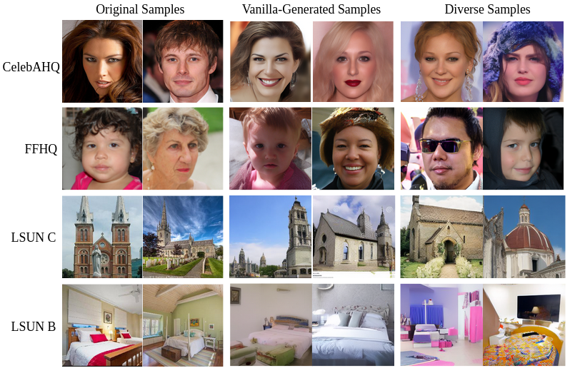
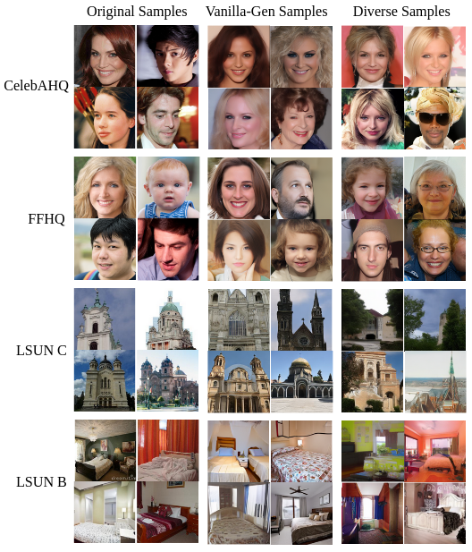
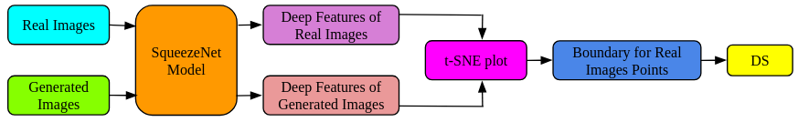
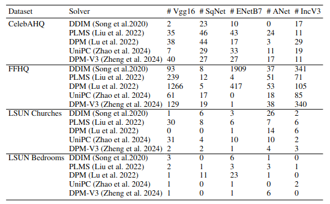
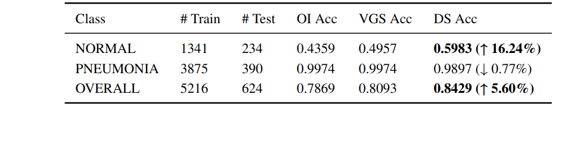

# The Deficit of New Information in Diffusion Models: A Focus on Diverse Samples

## Diverse Samples (DS)
- We introduce the concept of diverse samples (DS) to prove that generated images could contain information not present in the training data for diffusion models.

    
    
The figure above shows the comparison among original, vanilla-generated and diverse images sampled on four well known datasets.

    
    
The figure above shows more samples for the comparison among original, vanilla-generated and diverse images on four well known datasets.

- We calculate diverse samples (DS) as depicted below:

    

### Results
- The figure below shows the number of diverse images present in 50,000 generated samples on four well known datasets with each of the solver

    

- The figure below shows Chest X-ray dataset and its class-wise classification accuracy results on the test set with ResNet50 model. OI Acc denotes classification accuracy with original images, VGS Acc denotes classification accuracy with vanilla-generated samples, and DS Acc denotes classification accuracy with diverse samples. The last column shows the change in accuracy with diverse samples over original images.

    

