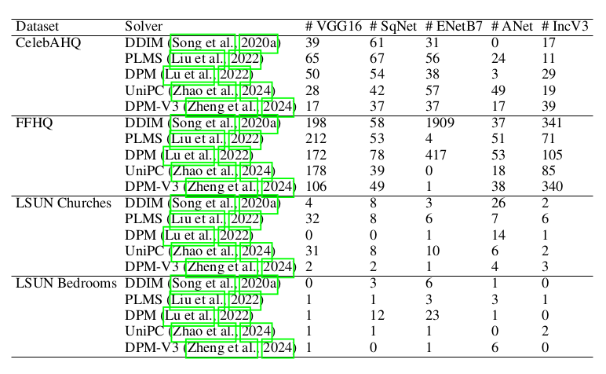

# The Deficit of New Information in Diffusion Models: A Focus on Diverse Samples

## Diverse Samples (DS)
- We introduce the concept of diverse samples (DS) to prove that generated images could contain information not present in the training data for diffusion models.

<div align="center">
    
    <p>The figure above shows the comparison among original, vanilla-generated and diverse images sampled on four well known datasets.</p>
</div>

<div align="center">
    
    <p>The figure above shows more samples for the comparison among original, vanilla-generated and diverse images on four well known datasets.</p>
</div>

- We calculate diverse samples (DS) as depicted below:

<div align="center">
    
</div>

- First, we generated 50,000 images on CelebAHQ, FFHQ, LSUN Churches, and LSUN Bedrooms datasets with the below code
```shell script
sample_diffusion.py
``` 
- We calculated diverse samples as per the code mentioned bleow:
```shell script
ds_sqnet.py
``` 

### Results
- The figure below shows the number of diverse images present in 50,000 generated samples on four well known datasets with each of the solver
<div align="center">
    
</div>

- our experiment on the Chest X-ray dataset demonstrates that the diverse samples are more useful in improving classification accuracy than vanilla-generated samples. The figure below shows Chest X-ray dataset and its class-wise classification accuracy results on the test set with ResNet50 model. OI Acc denotes classification accuracy with original images, VGS Acc denotes classification accuracy with vanilla-generated samples, and DS Acc denotes classification accuracy with diverse samples. The last column shows the change in accuracy with diverse samples over original images.
<div align="center">
    
</div>

### Implementation
  
- Set up a conda environment and install below libraries:

```shell script
pip install transformers==4.19.2 scann kornia==0.6.4 torchmetrics==0.6.0
pip install git+https://github.com/arogozhnikov/einops.git
```
- To generate images for datasets on CelebAHQ, FFHQ, LSUN Churches, and LSUN Bedrooms, we utilized the codes and pre-trained weights from [https://github.com/CompVis/latent-diffusion](https://github.com/CompVis/latent-diffusion). We also referred to this link to download the training images for all these datasets. We used the the following script to generate images:

```shell script
python scripts/sample_diffusion.py -r <path for model.ckpt> -l <output directory for sampled images> -n <number of samples to be generated> --batch_size <batch size> -c <number of inference steps> -e <eta>
```
- Example to generate samples of CelebAHQ dataset:
```shell script
python scripts/sample_diffusion.py -r /models/ldm/celeba256/model.ckpt -l /generated_samples/celebahq -n 50000 --batch_size 100 -c 8 -e 0
```
  
- To calculate the number of diverse samples from the generated images and to save the t-SNE plot along with the diverse images, use:
  
```shell script
python ds_sqnet.py <directory_of_real_images> <directory_of_generated_images> <directory_of_outputs> --batch_size 1000
```
- Example to calculate diverse samples of CelebAHQ dataset:
```shell script
python ds_sqnet.py /train_data/celebahq /generated_samples/celebahq /outputs/celebahq --batch_size 1000
```
- The following script is used to train the ResNet50 model for image classification on the Chest X-ray dataset [https://www.cell.com/cell/fulltext/S0092-8674(18)30154-5](https://www.cell.com/cell/fulltext/S0092-8674(18)30154-5), separately using real, generated, and diverse samples:
  
```shell script
python chest_img_classifier_train.py
```
- The resulting weights from the script above are then applied in the script below to evaluate accuracy and save all results into a CSV file.
```shell script
python chest_img_classifier_test.py
```


